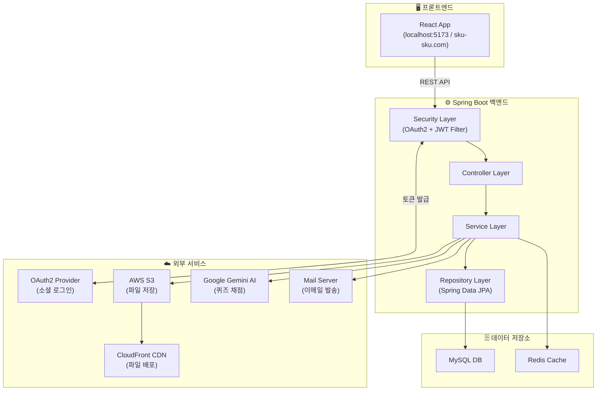
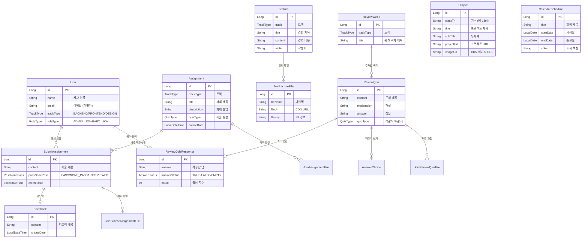
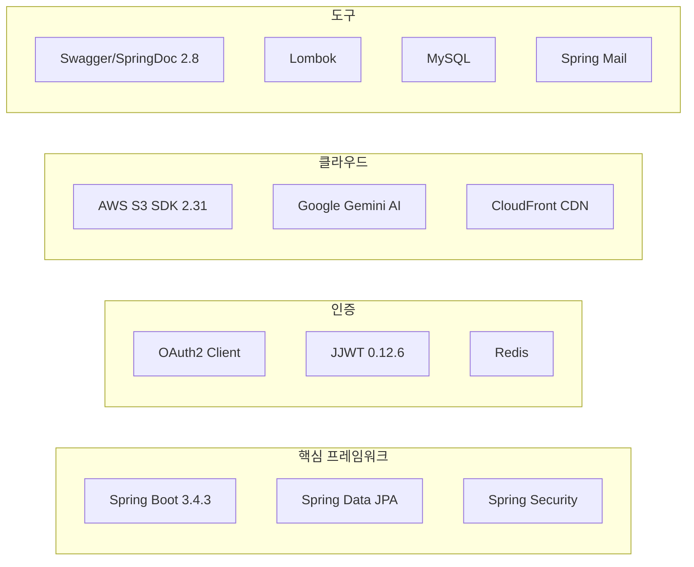

# 🦁 SKUSKU_Back 프로젝트 분석 브리핑

## 프로젝트 개요

**멋쟁이사자처럼 성공회대학교(SKU) 14기** 학회 관리 시스템의 **백엔드 API 서버**입니다.
학회 운영에 필요한 강의 자료 관리, 과제 제출/피드백, 복습 퀴즈, 프로젝트 갤러리, 일정 관리 등의 기능을 제공합니다.

| 항목 | 내용 |
|------|------|
| **프레임워크** | Spring Boot 3.4.3 |
| **언어** | Java 21 |
| **빌드 도구** | Gradle |
| **DB** | MySQL (JPA/Hibernate) |
| **캐시/세션** | Redis |
| **인증** | OAuth2 (소셜 로그인) + JWT |
| **파일 저장소** | AWS S3 + CloudFront CDN |
| **AI** | Google Cloud Gemini (주관식 퀴즈 자동 채점) |
| **API 문서** | Swagger (SpringDoc OpenAPI) |
| **도메인** | `sku-sku.com` |

---

## 아키텍처 다이어그램



---

## 패키지 구조

```
com.sku_sku.backend
├── SkuSkuApplication.java          # 메인 애플리케이션
├── config/                         # 설정 (WebClient 등)
├── controller/                     # 일반 사용자(아기사자) API
│   ├── admin/                      # 관리자(운영진) 전용 API
│   ├── AssignmentController        # 과제 관련
│   ├── CalendarScheduleController  # 일정 조회
│   ├── LectureController           # 강의 자료 조회
│   ├── OAuth2Controller            # 인증/로그인
│   ├── ProjectController           # 프로젝트 조회
│   ├── ReviewQuizController        # 복습 퀴즈
│   └── S3Controller                # 파일 업로드
├── domain/                         # JPA 엔티티
├── dto/                            # 요청/응답 DTO
│   ├── Request/                    # 요청 DTO (12개)
│   └── Response/                   # 응답 DTO (6개)
├── email/                          # 이메일 서비스
├── enums/                          # Enum 타입 정의
├── exception/                      # 커스텀 예외 + 전역 핸들러
├── repository/                     # Spring Data JPA Repository
├── security/                       # 보안 설정 (JWT, OAuth2, CORS)
└── service/                        # 비즈니스 로직
```

---

## 핵심 도메인 모델 (ER 다이어그램)



---

## 사용자 역할 & 권한 체계

| 역할 | Enum 값 | 접근 가능 API | 설명 |
|------|---------|-------------|------|
| **운영진 (Admin)** | `ADMIN_LION` | `/admin/**` + 일반 API | 과제 생성/수정, 강의 등록, 퀴즈 출제, 일정 관리, 피드백 작성 |
| **아기사자 (Member)** | `BABY_LION` | 일반 API만 | 과제 제출, 강의 조회, 퀴즈 풀기, 일정 확인, 프로젝트 조회 |
| **비인증 사용자** | - | `/project/all`, Swagger, OAuth2 | 프로젝트 갤러리 공개 조회만 가능 |

### 트랙 구분
- `BACKEND` — 백엔드 트랙
- `FRONTEND` — 프론트엔드 트랙
- `DESIGN` — 디자인 트랙

---

## 주요 기능 상세

### 1. 🔐 인증/보안
- **OAuth2 소셜 로그인** → 로그인 성공 시 JWT 발급
- **JWT 토큰 인증** — Stateless 세션 (쿠키/세션 미사용)
- **Redis** — 리프레시 토큰 등 토큰 관리에 활용
- **역할 기반 접근 제어** — Admin API는 `ADMIN_LION` 역할만 접근 가능

### 2. 📚 강의 관리 (Lecture)
- 운영진이 트랙별 강의 자료(제목, 내용, 첨부파일) 등록
- 아기사자는 본인 트랙 강의 자료 조회
- 파일 첨부: S3 Presigned URL → CloudFront CDN URL

### 3. 📝 과제 관리 (Assignment)
- 운영진이 트랙별 과제 생성(제목, 설명, 제출 유형)
- 아기사자가 과제 제출(`SubmitAssignment`) → 운영진이 PASS/NONE_PASS 판정
- 운영진이 피드백(`Feedback`) 작성 가능
- 파일 첨부 지원 (S3)

### 4. 🧠 복습 퀴즈 (ReviewQuiz)
- 주차(`ReviewWeek`)별로 퀴즈 관리
- **객관식** (`MULTIPLE_CHOICE`): 보기(`AnswerChoice`) 포함, 자동 채점
- **주관식** (`ESSAY_QUESTION`): **Google Gemini AI가 자동 채점** (정답 비교 → 맞음/틀림 + 이유 제공)
- 퀴즈 응답(`ReviewQuizResponse`)에 풀이 횟수 기록

### 5. 🚀 프로젝트 갤러리 (Project)
- 기수별 프로젝트 등록 (제목, 부제, URL, 대표 이미지)
- 비인증 사용자도 `/project/all`로 전체 공개 조회 가능
- 이미지: S3 + CloudFront CDN

### 6. 📅 캘린더 일정 (CalendarSchedule)
- 운영진이 학회 일정 등록 (시작일, 종료일, 색상)
- 아기사자는 월별 일정 조회

### 7. 📁 파일 관리 (S3)
- **Presigned URL 방식** — 서버를 거치지 않고 클라이언트가 직접 S3에 업로드
- CloudFront CDN URL로 빠른 파일 접근
- 허용 파일 타입 검증 (`AllowedFileType`)
- 5분간 유효한 임시 업로드 URL 발급

### 8. 📧 이메일 (Email)
- Spring Mail을 통한 이메일 발송 기능

---

## API 엔드포인트 요약

### 일반 사용자 (아기사자) API

| 메서드 | 엔드포인트 | 설명 |
|--------|-----------|------|
| POST | `/assignment/submit` | 과제 제출 |
| DELETE | `/assignment/delete/{id}` | 제출 과제 삭제 |
| PUT | `/assignment/update` | 제출 과제 수정 |
| GET | `/assignment/track/{trackType}` | 트랙별 과제 목록 |
| GET | `/assignment/{id}` | 과제 상세 조회 |
| GET | `/assignment/submit/{id}` | 제출한 과제 조회 |
| GET | `/lecture/**` | 강의 자료 조회 |
| GET/POST | `/reviewQuiz/**` | 복습 퀴즈 풀기 |
| GET | `/project/all` | 프로젝트 갤러리 (공개) |
| GET | `/schedule/**` | 일정 조회 |
| POST | `/s3/**` | 파일 업로드 URL 발급 |

### 관리자 (운영진) API (`/admin/`)

| 메서드 | 엔드포인트 | 설명 |
|--------|-----------|------|
| POST/PUT/DELETE | `/admin/assignment/**` | 과제 CRUD + 피드백 |
| POST/PUT/DELETE | `/admin/lecture/**` | 강의 자료 CRUD |
| POST/PUT/DELETE | `/admin/reviewQuiz/**` | 복습 퀴즈 CRUD |
| POST/PUT/DELETE | `/admin/project/**` | 프로젝트 CRUD |
| POST/PUT/DELETE | `/admin/schedule/**` | 일정 CRUD |

---

## 기술 스택 상세



---

## 프로젝트 특징 요약

> 이 프로젝트는 대학교 IT 동아리 **"멋쟁이사자처럼"** 의 운영 플랫폼으로,
> 사용자를 🦁 **"사자(Lion)"** 로 부르는 것이 가장 큰 특징입니다.

1. **역할 분리가 명확** — Admin 컨트롤러와 일반 컨트롤러가 완전 분리
2. **AI 자동 채점** — Gemini API로 주관식 퀴즈를 자동 채점하는 독특한 기능
3. **Presigned URL 패턴** — 서버 부하 없이 대용량 파일 업로드 처리
4. **실 서비스 운영 중** — `sku-sku.com` 도메인으로 배포되어 운영 중
5. **Stateless 보안** — OAuth2 + JWT 조합으로 세션 없이 인증 처리
